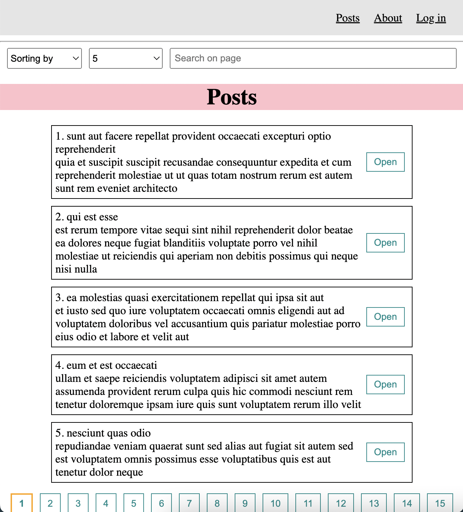
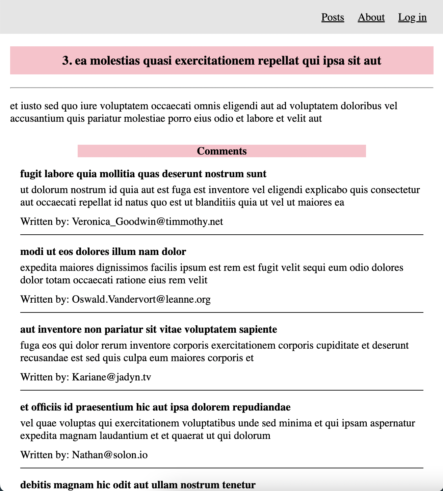

# Posts App (React + API)

This is a Single-Page blog with using [jsonplaceholder](https://jsonplaceholder.typicode.com) API.
Added all the necessary features for modern applications: *sorting, searching, pagination, routing*.
And simple authorization is also implemented, so you can log in as an admin and add or delete posts.

***Note: App developed with React v18 and [jsonplaceholder](https://jsonplaceholder.typicode.com) API.***

## Installation

1. Clone this project to your computer: `git clone https://github.com/vadikot/posts-react-app`
2. Install all npm packages in the project: `npm i`
3. Run the app: `npm start`

## Application screenshots

